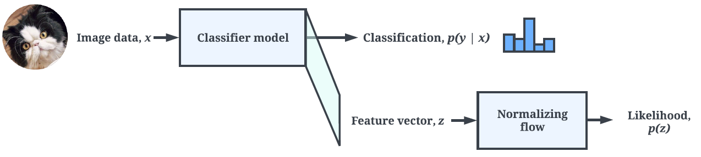
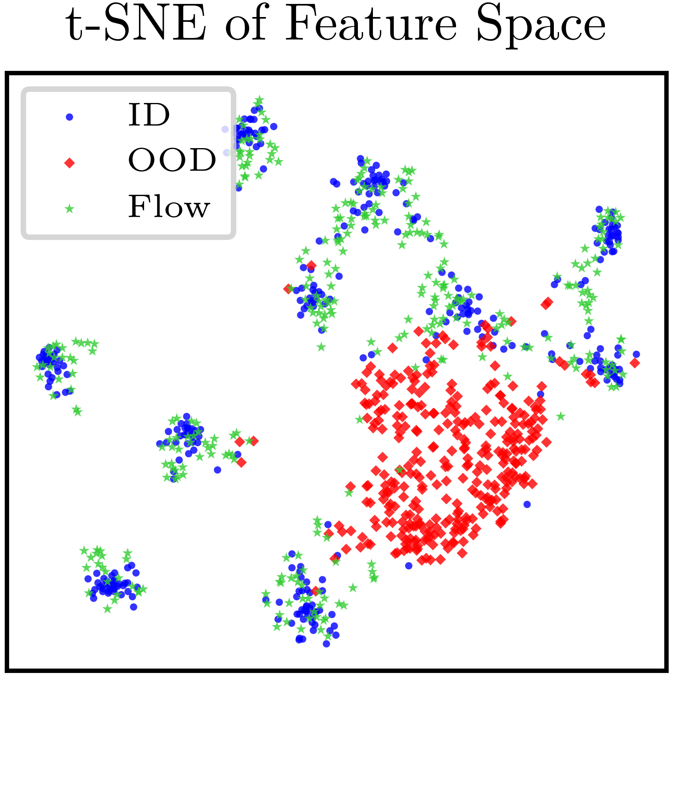
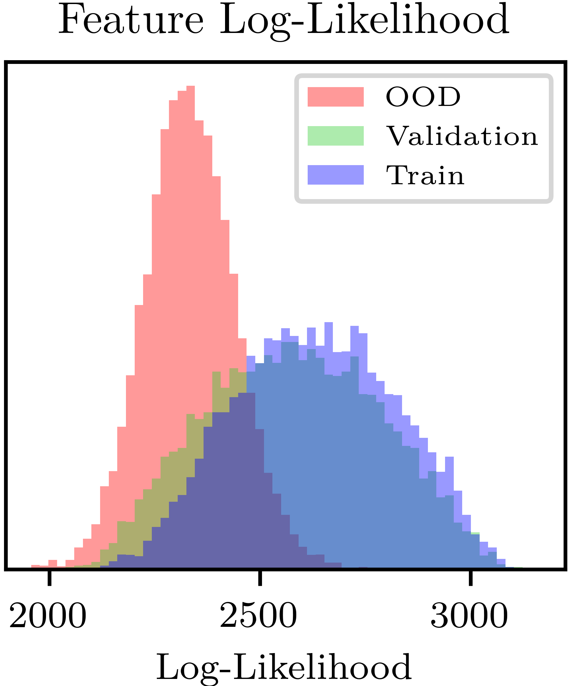

# FeatureDensityEstimation
This is the repository for the paper Feature Density Estimation via Normalizing Flows for Out of Distribution Detection ([arXiv](https://arxiv.org/abs/2402.06537)). This work has been accepted to [CRV 2024](https://www.computerrobotvision.org/).

This includes code to reproduce the paper's main ImageNet-1k results:
- Train a normalizing flow as a feature density estimator model on a dataset of image features extracted from a [pretrained ImageNet-1k classifier model](https://pytorch.org/vision/stable/models.html).
- Evaluate the flow model's performance for out-of-distribution detection (via AUROC).



<p float="left">
  
  
</p>

# Setup

To set up the project environment, follow these steps:

0. Clone this repository

1. Create and activate a virtual environment

```
# Create a virtual environment
python -m venv fde_venv

# Activate the virtual environment
# On Windows
fde_venv\Scripts\activate
# On macOS and Linux
source fde_venv/bin/activate
```

2. Install python dependencies

```
# Navigate to the project directory
cd FeatureDensityEstimation

# Install dependencies from requirements.txt
pip install -r requirements.txt
```

Update the pytorch versions for compatibility with your CUDA drivers, if necessary.

3. Download the ImageNet-1k dataset via the [the Image-Net download page](https://image-net.org/download.php). The default location is assumed to be `$HOME/data/ImageNet-1k`; update the config dictionary in the train and test scripts as necessary. This work was done using the 2012 version of the dataset.

# Training & Evaluating

To train & evaluate on a select few classifier backbones (ResNet50_V1, MobileNet_V2_V1, Swin_T, ViT_B_32) to reproduce the main results, use `./run_imagenet_select.sh`. To evaluate on [all supported ImageNet-1k backbone classifiers](https://pytorch.org/vision/stable/models.html), use `./run_imagenet_all.sh` (caution: may take a long time!).

To train a single normalizing flow feature density estimator model on ImageNet-1k features, use the script `train_feature_density_estimator.py`:

| Argument        | Description                                                         |
|-----------------|---------------------------------------------------------------------|
| `output_path`   | Output path of the normalizing flow model                           |
| `model_name`    | Name of the PyTorch pretrained ImageNet1k backbone model            |
| `--seed`        | Random seed (optional)                                              |
| `--epochs`      | Number of epochs to train the normalizing flow for (optional)       |
| `--batch_size`  | Training batch size (optional)                                      |

Example usage:

  `python train_feature_density_estimator.py "checkpoint/Flow_ResNet50_V1.pt" "ResNet50_V1" --seed=1`

To evaluate the resulting flow model's out-of-distribution detection performance (measured via AUROC) against several datasets, use the script `test_feature_density_estimator.py`:

| Argument        | Description                                                         |
|-----------------|---------------------------------------------------------------------|
| `input_path`    | Input path of the trained normalizing flow model                    |
| `model_name`    | Name of the PyTorch pretrained ImageNet1k backbone model (see imagenet_models.py)            |
| `log_path`      | Path to log results to (CSV format)                                 |
| `--quick`       | Quick evaluation; skip calculating ODIN, Uniformity, Tolerance      |

Results are saved in a `csv` file to a `results` subfolder. Example usage:

  `python test_feature_density_estimator.py "checkpoint/Flow_ResNet50_V1.pt" "ResNet50_V1" "results/imagenet_results.csv"`

You may need to adjust the batch size parameter based on your available GPU memory. All experiments were done on a single RTX3090 with 24GB of RAM.

## Datasets

This will evaluate the flow model's out-of-distribution detection performance using ImageNet-1k as in-distribution, and the following datasets as out-of-distribution:
- Textures
- iNaturalist
- SUN
- Places

## Baseline OOD Detection Methods

Running the evaluation script will compare our method (FDE, feature density estimation) with the following baselines:
- [Max Softmax Probability (MSP)](https://arxiv.org/abs/1610.02136)
- [Free Energy Score](https://arxiv.org/abs/2010.03759)
- [ODIN](https://arxiv.org/abs/1706.02690)
- [ReACT](https://arxiv.org/abs/2111.12797)

# Citing This Work

If you find this project useful for your research or work, we appreciate your citations using the following BibTeX entry:

```
@misc{cook2024feature,
      title={Feature Density Estimation for Out-of-Distribution Detection via Normalizing Flows},
      author={Evan D. Cook and Marc-Antoine Lavoie and Steven L. Waslander},
      year={2024},
      eprint={2402.06537},
      archivePrefix={arXiv},
      primaryClass={cs.CV}
}
```

Please send any questions and correspondence to evan.cook@robotics.utias.utoronto.ca.
